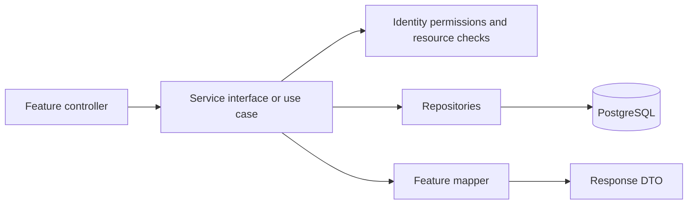

# Wayline architecture

Wayline is a feature-organized Spring Boot and React monolith with one PostgreSQL database. It remains one backend process and one frontend deployment. Features own their MVC layers; shared code contains only infrastructure and reusable API types. This is a production-oriented foundation, not a claim of high availability or unbounded scale.

## Backend layout

```text
backend/src/main/java/com/tms/
  TmsApplication.java             IntelliJ Run entry point (unchanged)
  bootstrap/                     Application-wide bean wiring
  identity/
    controller/                  Login, profile, recovery, staff endpoints
    dto/request/, dto/response/  Separate named request/response records
    domain/                      Role enum
    entity/, repository/         Accounts and reset tokens
    security/                    Principal, current account, permission policy
    service/, mapper/, config/
  catalog/                       Buses, layouts, stops, routes
  scheduling/                    Trips, trip inventory, scheduling, fare updates
  booking/                       Holds, online/counter bookings and cash records
  reporting/                     Occupancy and reporting API
  audit/                         Audit records and their repository/service
  shared/
    api/                         Pagination, common requests/responses
    config/                      Validated operator/reservation settings
    error/                       Exception model and HTTP error translation
    persistence/                 Base entity and paging validation
    security/                    Stateless hashing utility
    web/                         Bounded local rate limiter
```

Each feature uses `controller`, `dto`, `service`, `entity`, `repository`, and `mapper` folders where needed. `domain` holds feature enums. A feature does not need empty folders or an interface for every class. Existing interfaces remain useful entry points for controllers and cross-feature coordination.

## Booking responsibilities

| Component | Responsibility |
|---|---|
| ReservationService / DefaultReservationService | Stable application facade; delegates to transactional use cases |
| HoldService | Create, read, release and expire quoted seat holds |
| BookingService | Online confirmation, history, ownership, cancellation and manifests |
| CounterSalesService | Accountless walk-in sales and safe repeated requests |
| PaymentService | Cash collection, corrections and refund recording |
| SeatInventory | Shared trip lock and hold release/expiry operations; requires an existing transaction |
| scheduling.service.FareService | Changes future trip prices; never rewrites old quotes |

Controllers validate input and translate HTTP; they do not access repositories or return JPA entities. DTOs are independent top-level records. Feature mappers create explicit response snapshots. Entities/repositories retain their existing database table names, UUID relationships and constraints.

## Dependency rules



1. Controllers call services. They cannot import repositories or persistence entities.
2. Entity/domain types cannot depend on controllers, application services or DTOs.
3. Shared code cannot import a feature. General helpers do not live inside unrelated business services.
4. Business services use permissions instead of hard-coded role comparisons. Identity owns role provisioning and its policy.
5. Cross-feature changes that must be atomic stay in one Spring transaction. Seat allocation always locks the trip; idempotent sales lock the actor first.
6. Existing JPA associations cross feature boundaries. Reporting performs intentional cross-feature reads. These are package-level ownership boundaries, not isolated microservices or independently deployable modules.

`ArchitectureTest` enforces the first four source-level rules and checks that SeatInventory uses mandatory transaction propagation. These checks complement behavior tests; they do not prove complete modular isolation.

## Permissions

`identity/security/Permission.java` names business capabilities. `RolePermissions.java` is the explicit role-to-capability policy; adding a Role requires an exhaustive switch entry. Spring authorities and service authorization use those grants. Ownership, driver assignment, trip state and time limits remain service checks: a capability never replaces resource scope.

`python3 scripts/permissions.py` generates the frontend grant file. `--check` detects drift. UI hiding is only presentation; backend authorization remains authoritative. Existing role names and User JSON are unchanged.

## Frontend layout

```text
frontend/src/
  app/                           Shell, feature registry, session hook, error boundary, styles
  features/
    identity/{pages,components}/
    catalog/{pages,components}/
    scheduling/{pages,components}/
    booking/{pages,components}/
    reporting/pages/
  shared/
    api/client.js                HTTP, session cookies, CSRF, errors and timeout
    auth/                        Generated role grants and capability helpers
    lib/                         Currency/date formatting and CSV export
    ui/                          Shared accessible controls and dialogs
```

`app/features.jsx` registers pages, navigation, capability visibility and lazy-loaded components. `useSession` owns login-session initialization and expiration. Pages compose focused components such as TripEditor, Manifest, CounterSale, PaymentEditor and TicketView. The `@/` alias points to `src`, so moving a component does not require long relative paths.

## Scale and operations

- Occupancy queries aggregate seats and bookings for one bounded trip page instead of materializing each trip's full inventories and reservation lists. Trip lists fetch the referenced route/bus/driver together.
- Controllers keep existing pagination and input bounds. Catalogs and manifests are still unpaginated: add endpoint-compatible pagination/streaming before using very large datasets.
- PostgreSQL locks and constraints remain the authority for seat and schedule conflicts. Contention is per trip; load-test popular departures before increasing capacity.
- Sessions and rate limiting remain process-local. Multiple replicas require shared sessions and a shared/edge limiter, plus tested scheduler behavior. No distributed cache or message broker has been added.
- The production profile requires explicit database/origin/frontend settings, uses secure cookies and graceful shutdown. It does not provide TLS termination, deployment automation, monitoring, backups or disaster recovery.

See [extension guide](docs/EXTENDING-THE-SYSTEM.md), [refactor assessment](docs/REFACTOR-ASSESSMENT.md), and [production deployment prerequisites](docs/PRODUCTION.md).
