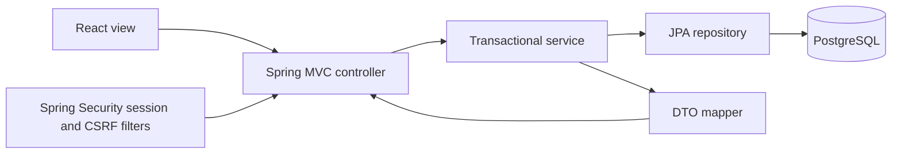

> Updated: counter staff, walk-in tickets, cash collection/refunds, and fare updates are documented in [Counter operations](docs/COUNTER-OPERATIONS.md).

# Architecture and module mapping

## Structure

```text
backend/src/main/java/com/tms/
  controller/          HTTP bindings, request validation, status codes
  dto/request/         Explicit typed input records and validation constraints
  dto/response/        Safe public, passenger, driver and admin output records
  entity/              JPA relational entities and lifecycle enums
  repository/          Spring Data JPA queries and pessimistic locks
  service/             Domain interfaces, audit, cleanup, rate limiting, reporting
  service/impl/        Account, fleet, trip and booking business rules
  mapper/              Entity-to-response conversion within transactions
  security/            Session principal and current-account/role checks
  config/              Security, clock and initial administrator
  exception/           Consistent API failures
backend/src/main/resources/db/migration/  Versioned SQL schema
frontend/src/
  api.js               Cookie/CSRF HTTP client and shared formatting
  components/          Forms, notices, dialogs and pagination
  pages/               Auth, journeys, bookings, fleet, operations, reports, profile
```



The frontend is the MVC view. Controllers bind DTOs and delegate; business services own permissions and transactions; repositories manage persistence. Entities are never returned from controllers. Lazy relationships are resolved inside service transactions, with Open Session in View disabled. Constructor injection is used throughout. This is one backend deployment, organized by layer, with clear domain service boundaries.

## Node.js → Spring Boot mapping

| Original module | New component / behavior |
|---|---|
| Express `index.js`, routers | Spring Boot application and typed MVC controllers under `/api/v1` |
| `locationController`, `locationModel` | `CatalogController`, `FleetService`, `Stop` / `StopRepository` |
| `timeController`, `timeModel` | Departure, arrival and sales timestamps on `Trip`; a global time-string table is unnecessary |
| `tripController`, `tripModel` | `TripController`, `TripService`, route/bus/driver foreign keys and trip lifecycle |
| `seatBookController`, dynamic model factory | `BookingService`, fixed `trip_seats`, `holds`, `bookings`, idempotency records |
| `userController`, unauthenticated user records | `AuthController`, `AccountService`, `Account`, Spring Security sessions |
| `EmailPdfService` prototype | SMTP account recovery plus printable ticket view; automatic booking email/PDF delivery remains deferred |
| Middleware/CORS | `SecurityConfiguration`: exact origins, credentials, session validation and CSRF |
| Ad hoc errors | `ApiErrors` and structured `Error` DTO |
| Mongoose validation/casts | Bean Validation, typed DTOs, service rules, PostgreSQL constraints |
| Two legacy React applications | One React application with passenger/admin/driver navigation and guarded backend access |

Legacy endpoint compatibility was appropriate for the earlier backend-only migration. This release intentionally replaces that contract and coordinates the frontend changes. There is no fallback write path under `/api/admin`, no student ID identity, no arbitrary Mongo collection selection, and no legacy email credentials in the deployment.

## Security and ownership

- Registration always creates PASSENGER; unknown input fields such as `role` are rejected.
- Only an administrator provisions ADMIN or DRIVER. Role is not editable through a profile request.
- Session cookies are HttpOnly and SameSite=Lax. Enable Secure behind HTTPS. Login rotates the session ID; logout invalidates it.
- Every mutation, including login/reset, requires the CSRF token returned by `/auth/csrf` in the same session.
- Passwords use BCrypt cost 12. Password validation respects BCrypt's 72-byte limit.
- Password reset stores a SHA-256 token hash, expires after 30 minutes, consumes it once and increments account authentication version. Existing sessions are revoked on their next request.
- Staff deactivation also increments authentication version. An administrator cannot deactivate their own account.
- Passenger ownership is checked in services. Unowned booking/hold resources return 404. Driver manifests require the assigned driver, not merely the DRIVER role.
- Public seat data contains label, row/column and state only. Contacts are exposed only through authorized booking/manifest responses.
- Authentication/reset/hold endpoints have bounded in-memory rate limits. These are per-process, suitable for the documented single-instance topology; distributed rate limiting is future work.
- Sensitive successful state changes create audit events in the same transaction. Failed attempts are not a complete security audit stream.

## Key decisions

1. **Trip-root lock:** every inventory mutation locks its trip. Simpler reasoning and atomic multi-seat changes take priority over maximum throughput. Separate trips can proceed independently.
2. **Account then trip lock:** hold/confirmation requests serialize per account, preventing duplicate concurrent idempotency inserts. Inventory operations never acquire account locks after trip locks.
3. **Database scheduling constraint:** PostgreSQL exclusion constraints arbitrate overlapping bus and driver assignments even across concurrent requests.
4. **Snapshots:** trip inventory, hold amount/policy, and booking contact/route/departure snapshots preserve the meaning of sold reservations.
5. **No destructive history deletion:** archive catalog resources, cancel trips/bookings explicitly, and retain references.
6. **Synchronous trip cancellation:** one transaction cancels bookings, releases holds and closes the trip. A failure rolls back the whole operation; the current bounded single-bus inventory does not require a background cancellation job.
7. **No file uploads:** multipart handling is disabled. The core product has no document/image upload requirement.
