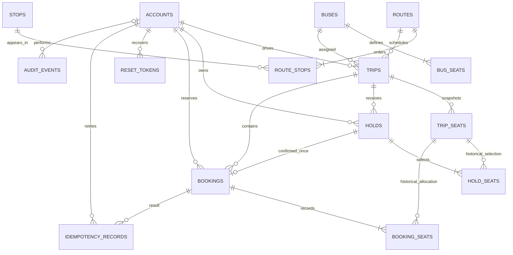

> Updated: counter staff, walk-in tickets, cash collection/refunds, and fare updates are documented in [Counter operations](COUNTER-OPERATIONS.md).

# PostgreSQL data model

UUID primary keys identify domain records; foreign keys use UUIDs rather than email or registration text. Timestamps are `timestamptz` and represented as UTC instants. Monetary amounts are integer minor units with an ISO currency code. Flyway V1 is the authoritative schema.



## Relationships and invariants

| Relationship | Meaning and constraint |
|---|---|
| Account → Trip | DRIVER assignment; service verifies active driver role |
| Bus → BusSeat | Reusable physical seat template; unique label and row/column within bus |
| Route → RouteStop → Stop | Ordered many-to-many relationship, no repeated stop, unique sequence |
| Route/Bus/Driver → Trip | Required many-to-one assignments |
| Trip → TripSeat | One inventory row per trip and seat label; copied on publish |
| Account/Trip → Hold | Temporary owned selection with expiry, amount and policy snapshot |
| Hold ↔ TripSeat | `hold_seats` preserves the selection; current ownership is `trip_seats.hold_id` |
| Hold → Booking | At most one booking per hold, enforced by unique `bookings.hold_id` |
| Booking ↔ TripSeat | `booking_seats` preserves historical seats; `trip_seats.booking_id` identifies the current allocation |
| Account/key → IdempotencyRecord | Unique `(actor_id, request_key)` prevents duplicate outcomes for a request |
| Account → ResetToken | Single-use expiring hashed token; raw token is emailed only |
| Account → AuditEvent | Actor/action/resource/reason/timestamp for committed changes |

Join-table history is deliberately retained after expiry/cancellation. A seat can appear in several historical selections/bookings, but its single inventory row has at most one current holder or booking. The database CHECK constraint rejects invalid state/link combinations: HELD requires only a hold; BOOKED requires only a booking; AVAILABLE/BLOCKED require neither.

Account email, bus registration, route code, booking reference and reset-token hash are unique. Routes/stops/buses are archived with `active=false`, not hard deleted. A route itinerary used by a non-draft trip cannot change; create a new route instead. A bus with published/departed trips cannot be edited. Published trip assignment/time/fare changes are rejected; cancel and publish a replacement.

## Scheduling exclusion constraints

`btree_gist` supplies UUID equality operators alongside timestamp range overlap:

```sql
EXCLUDE USING gist (
  bus_id WITH =,
  tstzrange(departure_at, reserved_until, '[)') WITH &&
) WHERE (status IN ('PUBLISHED','DEPARTED','COMPLETED'))
```

An equivalent constraint covers `driver_id`. `reserved_until = arrival_at + turnaround`. Half-open intervals allow the next departure exactly at the previous reserved end. Cancelled/draft trips do not occupy resources. Completed trips retain their historical assignment interval. Both assignment checks occur in PostgreSQL, not just in frontend validation.

## Reservation transactions

1. Hold: lock account then trip; reject closed sales; expire old holds; check every requested seat; insert hold and history links; change every selected inventory row to HELD; commit together.
2. Confirm: lock account; resolve an existing idempotency key before checking current hold state; reject different payload; lock trip; refresh hold; validate ownership, expiry, open sales and current seats; insert booking and history; consume hold, allocate seats, record key and audit; commit together.
3. Cancel booking: lock trip; refresh booking; verify owner/cutoff or admin override; free only inventory currently referencing this booking; update booking and audit together. A repeated old cancellation cannot release a later customer's seat.
4. Cancel trip: lock trip; close it, release active holds and cancel all confirmed reservations atomically.
5. Cleanup: each expired trip is locked and processed separately. It only frees inventory currently referencing the expired hold. Reads display an expired hold as available even before cleanup, and allocation checks expiry synchronously.

Idempotency records are retained indefinitely in this release. Replays return the same booking ID and current status (including cancellation); a consumed hold is also unique. No cleanup job deletes booking history or idempotency outcomes.

## Boundaries

The database cannot infer business authorization: driver role, passenger identity, cutoff permissions and legal transitions remain service checks. All application inventory mutations must preserve the trip-lock convention. Bulk SQL outside that convention is operationally unsafe. There are no automatic cascaded deletes of reservation history.

The design targets a single bus operator and one backend instance. Read-side catalog/report queries favor clarity over large-scale query tuning. No 10,000-trip load-test or production-throughput claim is made.
