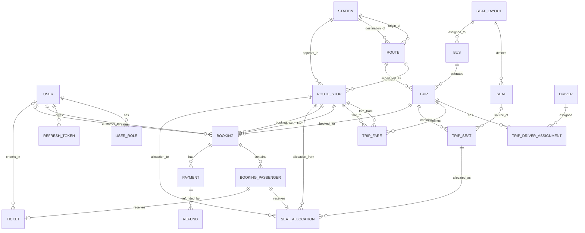

Below is the consolidated final specification with the corrected route chain, entity cardinalities, database schema, booking model, concurrency model, APIs, and incremental build sequence.

# Bus Reservation and Fleet Management System

## Final Complete Technical Documentation

---

# 1. Project Overview

The **Bus Reservation and Fleet Management System** is a production-style backend project developed with Java and Spring Boot.

The system manages the complete lifecycle of bus transportation operations:

- user authentication
- role-based access
- station management
- route management
- route stops
- seat layouts
- buses
- drivers
- trip scheduling
- trip-specific seats
- fares
- trip searching
- seat availability
- passenger bookings
- temporary seat holds
- concurrent booking protection
- payments
- tickets
- cancellations
- refunds
- administrative reporting
- audit logging
- notifications
- fleet maintenance

The project should be implemented as a **modular monolith**.

Microservices are intentionally avoided for Version 1 because the important engineering problems in this project are:

- relational modeling
- transactions
- concurrency
- security
- state transitions
- payment reliability
- database integrity
- testing
- deployment

---

# 2. Project Goal

The primary passenger workflow is:

```text
Register/Login
      ↓
Search Trips
      ↓
Choose Trip
      ↓
Select Boarding/Dropping Stops
      ↓
Check Seat Availability
      ↓
Select Seat(s)
      ↓
Create Temporary Hold
      ↓
Create Booking
      ↓
Make Payment
      ↓
Payment Success
      ↓
Confirm Booking
      ↓
Generate Ticket
      ↓
Check-In / Travel
```

Alternative flow:

```text
Booking Created
      ↓
Payment Not Completed
      ↓
Hold Expires
      ↓
Booking EXPIRED
      ↓
Seats Become Available
```

Cancellation flow:

```text
Confirmed Booking
      ↓
Cancellation Request
      ↓
Validate Policy
      ↓
Cancel Passenger/Booking
      ↓
Release Seat
      ↓
Create Refund
```

---

# 3. Technology Stack

## Backend

- Java 21
- Spring Boot
- Spring MVC
- Spring Security
- Spring Data JPA
- Hibernate
- Jakarta Bean Validation

## Database

- PostgreSQL
- Flyway

## Authentication

- JWT access token
- refresh tokens
- BCrypt password hashing
- role-based authorization

## API Documentation

- OpenAPI
- Swagger UI

## Testing

- JUnit 5
- Mockito
- Spring Boot Test
- MockMvc or REST Assured
- Testcontainers PostgreSQL

## Build and Deployment

- Maven
- Docker
- Docker Compose
- Git
- GitHub
- GitHub Actions

## Monitoring

- Spring Boot Actuator

---

# 4. Architectural Style

Use a modular monolithic architecture.

```text
Frontend / API Client
        │
        │ REST/JSON
        ▼
┌───────────────────────────────┐
│        Spring Security        │
│    JWT Authentication/RBAC    │
└───────────────┬───────────────┘
                │
                ▼
┌────────────────────────────────────────┐
│        Spring Boot Application         │
│                                        │
│ Auth                                   │
│ Users                                  │
│ Stations                               │
│ Routes                                 │
│ Fleet                                  │
│ Trips                                  │
│ Booking                                │
│ Payments                               │
│ Tickets                                │
│ Reporting                              │
└────────────────────┬───────────────────┘
                     │
                Spring Data JPA
                     │
                     ▼
               PostgreSQL
```

---

# 5. Main Application Roles

Use four primary roles:

```text
ADMIN
MANAGER
COUNTER_STAFF
PASSENGER
```

## ADMIN

Can manage:

- users
- stations
- routes
- seat layouts
- buses
- drivers
- trips
- fares
- bookings
- payments
- reports

## MANAGER

Can manage:

- buses
- drivers
- trips
- fares
- operational reports

## COUNTER_STAFF

Can:

- search trips
- view seats
- create passenger bookings
- accept supported counter payments
- verify tickets
- check in passengers

## PASSENGER

Can:

- register
- login
- search trips
- view seats
- book seats
- make payments
- view tickets
- cancel eligible bookings

A Driver does not need to be an application User unless a driver-facing application is added later.

---

# 6. Final Core Entities

## Authentication

1. User
2. UserRole
3. RefreshToken

## Route Network

4. Station
5. Route
6. RouteStop

## Fleet

7. SeatLayout
8. Seat
9. Bus
10. Driver

## Trip Operations

11. Trip
12. TripDriverAssignment
13. TripFare
14. TripSeat

## Reservation

15. Booking
16. BookingPassenger
17. SeatAllocation

## Finance

18. Payment
19. Refund

## Ticketing

20. Ticket

## Optional Extensions

21. NotificationLog
22. AuditLog
23. BusMaintenance
24. ScheduleTemplate
25. ScheduleTemplateDay

---

# 7. Corrected Core ER Diagram



---

# 8. Correct Route Chain

The correct route model begins from `Route`, not `Station`.

```text
ROUTE
  ├── 1:N ── ROUTE_STOP ── N:1 ── STATION
  │
  └── 1:N ── TRIP
```

Detailed representation:

```text
                         STATION
                         ▲     ▲
                         │     │
                    origin   destination
                         │     │
                         └─ ROUTE ─┐
                              │    │
                              │    └────── 1:N ────── TRIP
                              │
                              │ 1:N
                              ▼
                         ROUTE_STOP
                              │
                              │ N:1
                              ▼
                           STATION
```

Example:

```text
ROUTE: Dhaka → Mymensingh

├── RouteStop 1 → Dhaka
├── RouteStop 2 → Gazipur
├── RouteStop 3 → Bhaluka
├── RouteStop 4 → Trishal
└── RouteStop 5 → Mymensingh
```

Then:

```text
ROUTE
 ├── Trip 1 → 30 Sep, 08:00
 ├── Trip 2 → 30 Sep, 14:00
 └── Trip 3 → 01 Oct, 08:00
```

---

# 9. Fleet Chain

```text
SEAT_LAYOUT
   ├── 1:N → SEAT
   │
   └── 1:N → BUS
                │
                │ 1:N
                ▼
               TRIP
                │
                │ 1:N
                ▼
            TRIP_SEAT
```

---

# 10. Reservation Chain

```text
BOOKING
    │
    │ 1:N
    ▼
BOOKING_PASSENGER
    │
    │ 1:0..1
    ▼
SEAT_ALLOCATION
    │
    │ N:1
    ▼
TRIP_SEAT
```

---

# 11. Payment Chain

```text
BOOKING
    │
    │ 1:N
    ▼
PAYMENT
    │
    │ 1:N
    ▼
REFUND
```

---

# 12. Ticket Chain

```text
BOOKING
    │
    ▼
BOOKING_PASSENGER
    │
    │ 1:0..1
    ▼
TICKET
```

A ticket does not exist before booking confirmation.

---

# 13. Complete Cardinality Reference

| Parent | Child | Parent → Child | Child → Parent |
|---|---|---:|---:|
| User | UserRole | 0..N | 1 |
| User | RefreshToken | 0..N | 1 |
| User | Booking as creator | 0..N | 1 |
| User | Booking as customer | 0..N | 0..1 |
| Route | RouteStop | 0..N DB, minimum 2 business rule | 1 |
| Station | RouteStop | 0..N | 1 |
| Station | Route origin | 0..N | 1 |
| Station | Route destination | 0..N | 1 |
| SeatLayout | Seat | 0..N | 1 |
| SeatLayout | Bus | 0..N | 1 |
| Route | Trip | 0..N | 1 |
| Bus | Trip | 0..N | 1 |
| Trip | TripDriverAssignment | 0..N | 1 |
| Driver | TripDriverAssignment | 0..N | 1 |
| Trip | TripFare | 0..N | 1 |
| Trip | TripSeat | 0..N | 1 |
| Seat | TripSeat | 0..N | 0..1 source |
| Trip | Booking | 0..N | 1 |
| Booking | BookingPassenger | 0..N DB, minimum 1 business rule | 1 |
| BookingPassenger | SeatAllocation | 0..1 | 1 |
| TripSeat | SeatAllocation | 0..N | 1 |
| Booking | Payment | 0..N | 1 |
| Payment | Refund | 0..N | 1 |
| BookingPassenger | Ticket | 0..1 | 1 |
| User | Ticket check-in user | 0..N | 0..1 |

---

# 14. User Entity

```text
User
────────────────────────
id
firstName
lastName
email
phone
passwordHash
status
emailVerified
createdAt
updatedAt
```

Status:

```text
ACTIVE
SUSPENDED
DISABLED
```

---

# 15. Booking/User Relationship

Booking contains two User references.

```text
Booking.createdByUserId
```

Mandatory.

Represents the account that created the booking.

Examples:

- passenger
- counter staff
- admin

```text
Booking.customerUserId
```

Optional.

Represents the registered passenger/customer.

Example guest booking:

```text
createdByUserId = Counter Staff ID
customerUserId = NULL

contactName = "Rahim Ahmed"
contactPhone = "017..."
```

---

# 16. Station

```text
Station
────────────────────────
id
code
name
city
district
address
latitude
longitude
active
```

Example:

```text
Code: DHK-GAB
Name: Gabtoli Bus Terminal
City: Dhaka
```

---

# 17. Route

```text
Route
────────────────────────
id
code
name
originStationId
destinationStationId
distanceKm
estimatedDurationMinutes
active
```

Business rule:

```text
originStationId != destinationStationId
```

---

# 18. RouteStop

```text
RouteStop
────────────────────────
id
routeId
stationId
stopOrder
arrivalOffsetMinutes
departureOffsetMinutes
distanceFromOriginKm
boardingAllowed
droppingAllowed
```

Important rules:

```text
stopOrder > 0

first RouteStop.station = Route.originStation

last RouteStop.station = Route.destinationStation

stopOrder unique inside Route
```

---

# 19. SeatLayout

```text
SeatLayout
────────────────────────
id
name
totalSeats
deckType
active
```

Example:

```text
Standard 40 Seat
Business 28 Seat
Sleeper 30 Berth
```

---

# 20. Seat

```text
Seat
────────────────────────
id
seatLayoutId
seatNumber
rowNumber
columnNumber
seatType
deck
active
```

Seat types:

```text
REGULAR
WINDOW
AISLE
BUSINESS
SLEEPER
```

---

# 21. Bus

```text
Bus
────────────────────────
id
registrationNumber
coachNumber
name
seatLayoutId
busType
manufacturer
model
manufacturingYear
status
createdAt
updatedAt
```

Status:

```text
ACTIVE
MAINTENANCE
INACTIVE
```

---

# 22. Driver

```text
Driver
────────────────────────
id
employeeCode
name
phone
email
licenseNumber
licenseExpiryDate
status
createdAt
updatedAt
```

Status:

```text
ACTIVE
ON_LEAVE
SUSPENDED
INACTIVE
```

---

# 23. Trip

A Route represents the reusable journey definition.

A Trip represents one execution.

```text
Route:
Dhaka → Mymensingh
```

Example Trip:

```text
Date: 30 Sep
Departure: 08:00
Arrival: 11:30
Bus: Coach 101
```

Entity:

```text
Trip
────────────────────────
id
tripNumber
routeId
busId
departureDateTime
arrivalDateTime
status
boardingOpen
createdAt
updatedAt
```

Status:

```text
SCHEDULED
BOARDING
DEPARTED
COMPLETED
CANCELLED
```

---

# 24. Trip Driver Assignment

Use `TripDriverAssignment` rather than a generic crew table.

```text
TripDriverAssignment
────────────────────────
id
tripId
driverId
driverRole
```

Roles:

```text
PRIMARY_DRIVER
SECONDARY_DRIVER
```

Relationships:

```text
Trip 1 ─── 0..N TripDriverAssignment

Driver 1 ─── 0..N TripDriverAssignment
```

Non-driver staff can be modeled separately later if needed.

---

# 25. Bus/Driver Trip Conflict Rule

A Bus or Driver cannot be assigned to overlapping active trips.

Two periods overlap when:

```text
existingDeparture < requestedArrival

AND

existingArrival > requestedDeparture
```

Example:

```text
Existing:
08:00 → 12:00

Requested:
10:00 → 14:00
```

Conflict.

Ignore cancelled trips.

---

# 26. TripFare

```text
TripFare
────────────────────────
id
tripId
fromRouteStopId
toRouteStopId
seatType
amount
currency
```

Business validation:

```text
fromRouteStop.routeId = Trip.routeId

toRouteStop.routeId = Trip.routeId

fromStopOrder < toStopOrder

amount >= 0
```

Money must use:

```text
BigDecimal
```

Never:

```text
double
```

---

# 27. TripSeat

`TripSeat` represents a seat inventory snapshot for one Trip.

```text
TripSeat
────────────────────────
id
tripId
sourceSeatId
seatNumber
seatType
deck
version
```

When a Trip is created:

```text
Trip
 ↓
Bus
 ↓
SeatLayout
 ↓
Active Seats
 ↓
TripSeat Snapshots
```

If Bus has 40 seats:

```text
Trip created
↓
40 TripSeat records created
```

This protects historical trips if the Bus layout changes later.

---

# 28. Booking

```text
Booking
────────────────────────
id
bookingNumber

createdByUserId
customerUserId

contactName
contactPhone
contactEmail

tripId

fromRouteStopId
toRouteStopId

status

subtotal
discountAmount
serviceFee
totalAmount
currency

expiresAt
confirmedAt
cancelledAt

createdAt
updatedAt
```

---

# 29. Booking Status

Use:

```text
PENDING_PAYMENT
CONFIRMED
PARTIALLY_CANCELLED
CANCELLED
EXPIRED
```

State model:

```text
                     ┌──→ EXPIRED
                     │
PENDING_PAYMENT ─────┤
                     │
                     └──→ CONFIRMED
                              │
                              ├──→ PARTIALLY_CANCELLED
                              │
                              └──→ CANCELLED
```

Do not use:

```text
REFUNDED
PARTIALLY_REFUNDED
```

as Booking statuses.

Refund is financial state.

---

# 30. BookingPassenger

```text
BookingPassenger
────────────────────────
id
bookingId
name
phone
age
gender
identityDocumentType
identityDocumentNumber
fare
status
createdAt
updatedAt
```

Passenger status:

```text
BOOKED
CANCELLED
```

Check-in state belongs to `Ticket`, avoiding duplicated state.

---

# 31. SeatAllocation

```text
SeatAllocation
────────────────────────
id
tripSeatId
bookingPassengerId

fromRouteStopId
toRouteStopId

fromStopOrder
toStopOrder

status
expiresAt

createdAt
updatedAt
```

Status:

```text
HELD
CONFIRMED
CANCELLED
EXPIRED
```

Only:

```text
HELD
CONFIRMED
```

block another booking.

---

# 32. Segment-Based Seat Reuse

Route:

```text
1 Dhaka
2 Gazipur
3 Bhaluka
4 Trishal
5 Mymensingh
```

Passenger A:

```text
Seat A1
Dhaka → Bhaluka

[1,3)
```

Passenger B:

```text
Seat A1
Bhaluka → Mymensingh

[3,5)
```

No overlap exists.

Therefore the same physical seat can be sold again.

---

# 33. Segment Overlap Formula

Segments overlap when:

```text
existingFrom < requestedTo

AND

existingTo > requestedFrom
```

Example:

```text
Existing:
1 → 4

Requested:
3 → 5
```

```text
1 < 5 = true
4 > 3 = true
```

Result:

```text
OVERLAP
```

Seat unavailable.

---

# 34. Non-Overlap Example

```text
Existing:
1 → 3

Requested:
3 → 5
```

```text
1 < 5 = true
3 > 3 = false
```

Result:

```text
NO OVERLAP
```

Seat available.

---

# 35. Why TripSeat Is Locked

Do not attempt to lock only `SeatAllocation`.

Initially there may be no SeatAllocation row.

Both concurrent transactions could see:

```text
0 conflicting rows
```

and both book the same seat.

`TripSeat` always exists.

Therefore:

```text
SELECT TripSeat
FOR UPDATE
```

provides a stable database lock.

---

# 36. Booking Transaction

Booking creation must execute inside one transaction.

```text
BEGIN

1. Authenticate user

2. Load Trip

3. Validate Trip status

4. Validate departure time

5. Load from RouteStop

6. Load to RouteStop

7. Verify both belong to Trip.route

8. Verify fromOrder < toOrder

9. Sort requested TripSeat IDs

10. Lock TripSeat rows

11. Check active overlapping SeatAllocations

12. If conflict:
       throw SeatNotAvailableException

13. Calculate fare on server

14. Create Booking

15. Create BookingPassengers

16. Create HELD SeatAllocations

17. Set Booking.expiresAt

COMMIT
```

Use:

```java
@Transactional
```

---

# 37. Multi-Seat Booking

Example request:

```text
A1
A2
A3
```

Always lock seats using deterministic ordering.

Example:

```text
sort by TripSeat.id

A1
A2
A3
```

This reduces deadlock risk.

If A2 is unavailable:

```text
Entire transaction rolls back.
```

Do not partially reserve A1 and A3.

---

# 38. Temporary Seat Hold

After booking creation:

```text
Booking.status
=
PENDING_PAYMENT
```

and:

```text
SeatAllocation.status
=
HELD
```

Example configured hold:

```text
10 minutes
```

Store:

```text
expiresAt
```

Do not hardcode the duration throughout Java code.

---

# 39. Booking Expiration

Scheduled service checks:

```text
status = PENDING_PAYMENT

AND

expiresAt < currentTime
```

Then:

```text
Booking
PENDING_PAYMENT → EXPIRED
```

and:

```text
SeatAllocation
HELD → EXPIRED
```

The seat becomes available again.

Expiration and payment confirmation should both lock the relevant Booking before changing state to prevent race conditions.

---

# 40. Payment

A Booking may have several Payment attempts.

```text
Booking
 ├── Payment 1 → FAILED
 ├── Payment 2 → FAILED
 └── Payment 3 → SUCCESS
```

Correct cardinality:

```text
Booking 1 ─── 0..N Payment
```

---

# 41. Payment Entity

```text
Payment
────────────────────────
id
bookingId

paymentReference
idempotencyKey

provider
method

amount
currency

status

providerTransactionId
failureReason

createdAt
paidAt
```

Status:

```text
PENDING
SUCCESS
FAILED
CANCELLED
```

Methods:

```text
CARD
MOBILE_BANKING
CASH
BANK
```

---

# 42. Payment Gateway Abstraction

Use:

```java
public interface PaymentGateway {

    PaymentInitiationResult initiate(...);

    PaymentVerificationResult verify(...);

    RefundResult refund(...);
}
```

Initial implementation:

```text
MockPaymentGateway
```

Later:

```text
SslCommerzPaymentGateway
StripePaymentGateway
```

Booking logic should not depend on a specific gateway.

---

# 43. Payment Confirmation

```text
Receive Callback
      ↓
Verify Gateway
      ↓
Check Idempotency
      ↓
Lock Booking
      ↓
Check Current State
      ↓
Payment → SUCCESS
      ↓
Booking → CONFIRMED
      ↓
SeatAllocation → CONFIRMED
      ↓
Generate Tickets
```

---

# 44. Payment Idempotency

Providers may send duplicate callbacks.

```text
Callback 1 → SUCCESS
Callback 2 → same transaction
Callback 3 → same transaction
```

Result must remain:

```text
1 successful Payment processing

1 Booking confirmation

1 Ticket per passenger
```

Use:

```text
idempotencyKey

(provider, providerTransactionId)
```

uniqueness.

---

# 45. Refund

```text
Refund
────────────────────────
id
paymentId
refundReference
amount
reason
status
providerRefundId
createdAt
processedAt
```

Status:

```text
REQUESTED
PROCESSING
SUCCESS
FAILED
```

Relationship:

```text
Payment 1 ─── 0..N Refund
```

This supports partial refunds.

Do not duplicate `bookingId` inside Refund.

Booking is available through:

```text
Refund
 ↓
Payment
 ↓
Booking
```

---

# 46. Ticket

Ticket belongs to one BookingPassenger.

```text
Ticket
────────────────────────
id
bookingPassengerId
ticketNumber
qrToken
status
issuedAt
checkedInAt
checkedInByUserId
```

Status:

```text
VALID
CHECKED_IN
CANCELLED
```

Relationship:

```text
BookingPassenger 1 ─── 0..1 Ticket
```

Before payment:

```text
Passenger exists
Ticket does not exist
```

After booking confirmation:

```text
Passenger → Ticket
```

---

# 47. Cancellation

Full cancellation:

```text
CONFIRMED Booking
      ↓
Validate Cancellation Policy
      ↓
Booking → CANCELLED
      ↓
Passengers → CANCELLED
      ↓
SeatAllocations → CANCELLED
      ↓
Tickets → CANCELLED
      ↓
Create Refund
```

---

# 48. Partial Cancellation

Booking:

```text
Rahim → A1
Karim → A2
Hasan → A3
```

Cancel Karim only:

```text
Rahim → BOOKED
Karim → CANCELLED
Hasan → BOOKED
```

Booking:

```text
PARTIALLY_CANCELLED
```

If all passengers are cancelled:

```text
Booking → CANCELLED
```

---

# 49. Complete Database Schema

## PostgreSQL Design Rules

Recommended:

```text
Primary key:
BIGINT identity

Money:
NUMERIC(12,2)

Date/time:
TIMESTAMPTZ

Boolean:
BOOLEAN

Audit JSON:
JSONB

Schema migration:
Flyway
```

---

# 50. users

```sql
CREATE TABLE users (
    id BIGINT GENERATED BY DEFAULT AS IDENTITY PRIMARY KEY,

    first_name VARCHAR(100) NOT NULL,
    last_name VARCHAR(100),

    email VARCHAR(255) NOT NULL,
    phone VARCHAR(30),

    password_hash VARCHAR(255) NOT NULL,

    status VARCHAR(30) NOT NULL DEFAULT 'ACTIVE',
    email_verified BOOLEAN NOT NULL DEFAULT FALSE,

    created_at TIMESTAMPTZ NOT NULL DEFAULT CURRENT_TIMESTAMP,
    updated_at TIMESTAMPTZ NOT NULL DEFAULT CURRENT_TIMESTAMP,

    CONSTRAINT uk_users_email UNIQUE (email),
    CONSTRAINT uk_users_phone UNIQUE (phone),

    CONSTRAINT chk_users_status CHECK (
        status IN ('ACTIVE', 'SUSPENDED', 'DISABLED')
    )
);
```

---

# 51. user_roles

```sql
CREATE TABLE user_roles (
    user_id BIGINT NOT NULL,
    role VARCHAR(50) NOT NULL,

    PRIMARY KEY (user_id, role),

    CONSTRAINT fk_user_roles_user
        FOREIGN KEY (user_id)
        REFERENCES users(id)
        ON DELETE CASCADE,

    CONSTRAINT chk_user_roles_role CHECK (
        role IN (
            'ADMIN',
            'MANAGER',
            'COUNTER_STAFF',
            'PASSENGER'
        )
    )
);
```

---

# 52. refresh_tokens

```sql
CREATE TABLE refresh_tokens (
    id BIGINT GENERATED BY DEFAULT AS IDENTITY PRIMARY KEY,

    user_id BIGINT NOT NULL,

    token_hash VARCHAR(255) NOT NULL,

    expires_at TIMESTAMPTZ NOT NULL,
    revoked_at TIMESTAMPTZ,

    created_at TIMESTAMPTZ NOT NULL DEFAULT CURRENT_TIMESTAMP,

    CONSTRAINT uk_refresh_tokens_hash UNIQUE (token_hash),

    CONSTRAINT fk_refresh_tokens_user
        FOREIGN KEY (user_id)
        REFERENCES users(id)
        ON DELETE CASCADE
);
```

Indexes:

```sql
CREATE INDEX idx_refresh_tokens_user
ON refresh_tokens(user_id);

CREATE INDEX idx_refresh_tokens_expiry
ON refresh_tokens(expires_at);
```

---

# 53. stations

```sql
CREATE TABLE stations (
    id BIGINT GENERATED BY DEFAULT AS IDENTITY PRIMARY KEY,

    code VARCHAR(30) NOT NULL,
    name VARCHAR(150) NOT NULL,

    city VARCHAR(100) NOT NULL,
    district VARCHAR(100),

    address TEXT,

    latitude NUMERIC(9,6),
    longitude NUMERIC(9,6),

    active BOOLEAN NOT NULL DEFAULT TRUE,

    created_at TIMESTAMPTZ NOT NULL DEFAULT CURRENT_TIMESTAMP,
    updated_at TIMESTAMPTZ NOT NULL DEFAULT CURRENT_TIMESTAMP,

    CONSTRAINT uk_stations_code UNIQUE (code),

    CONSTRAINT chk_stations_latitude CHECK (
        latitude IS NULL OR latitude BETWEEN -90 AND 90
    ),

    CONSTRAINT chk_stations_longitude CHECK (
        longitude IS NULL OR longitude BETWEEN -180 AND 180
    )
);
```

---

# 54. routes

```sql
CREATE TABLE routes (
    id BIGINT GENERATED BY DEFAULT AS IDENTITY PRIMARY KEY,

    code VARCHAR(50) NOT NULL,
    name VARCHAR(150) NOT NULL,

    origin_station_id BIGINT NOT NULL,
    destination_station_id BIGINT NOT NULL,

    distance_km NUMERIC(8,2),
    estimated_duration_minutes INTEGER,

    active BOOLEAN NOT NULL DEFAULT TRUE,

    created_at TIMESTAMPTZ NOT NULL DEFAULT CURRENT_TIMESTAMP,
    updated_at TIMESTAMPTZ NOT NULL DEFAULT CURRENT_TIMESTAMP,

    CONSTRAINT uk_routes_code UNIQUE (code),

    CONSTRAINT fk_routes_origin
        FOREIGN KEY (origin_station_id)
        REFERENCES stations(id),

    CONSTRAINT fk_routes_destination
        FOREIGN KEY (destination_station_id)
        REFERENCES stations(id),

    CONSTRAINT chk_routes_terminals CHECK (
        origin_station_id <> destination_station_id
    ),

    CONSTRAINT chk_routes_distance CHECK (
        distance_km IS NULL OR distance_km >= 0
    ),

    CONSTRAINT chk_routes_duration CHECK (
        estimated_duration_minutes IS NULL
        OR estimated_duration_minutes > 0
    )
);
```

---

# 55. route_stops

```sql
CREATE TABLE route_stops (
    id BIGINT GENERATED BY DEFAULT AS IDENTITY PRIMARY KEY,

    route_id BIGINT NOT NULL,
    station_id BIGINT NOT NULL,

    stop_order INTEGER NOT NULL,

    arrival_offset_minutes INTEGER,
    departure_offset_minutes INTEGER,

    distance_from_origin_km NUMERIC(8,2),

    boarding_allowed BOOLEAN NOT NULL DEFAULT TRUE,
    dropping_allowed BOOLEAN NOT NULL DEFAULT TRUE,

    CONSTRAINT fk_route_stops_route
        FOREIGN KEY (route_id)
        REFERENCES routes(id),

    CONSTRAINT fk_route_stops_station
        FOREIGN KEY (station_id)
        REFERENCES stations(id),

    CONSTRAINT uk_route_stops_order
        UNIQUE (route_id, stop_order),

    CONSTRAINT chk_route_stops_order CHECK (
        stop_order > 0
    ),

    CONSTRAINT chk_route_stops_arrival CHECK (
        arrival_offset_minutes IS NULL
        OR arrival_offset_minutes >= 0
    ),

    CONSTRAINT chk_route_stops_departure CHECK (
        departure_offset_minutes IS NULL
        OR departure_offset_minutes >= 0
    ),

    CONSTRAINT chk_route_stops_distance CHECK (
        distance_from_origin_km IS NULL
        OR distance_from_origin_km >= 0
    )
);
```

Indexes:

```sql
CREATE INDEX idx_route_stops_route_order
ON route_stops(route_id, stop_order);

CREATE INDEX idx_route_stops_station
ON route_stops(station_id);
```

---

# 56. seat_layouts

```sql
CREATE TABLE seat_layouts (
    id BIGINT GENERATED BY DEFAULT AS IDENTITY PRIMARY KEY,

    name VARCHAR(100) NOT NULL,

    total_seats INTEGER NOT NULL,

    deck_type VARCHAR(30) NOT NULL DEFAULT 'SINGLE',

    active BOOLEAN NOT NULL DEFAULT TRUE,

    created_at TIMESTAMPTZ NOT NULL DEFAULT CURRENT_TIMESTAMP,
    updated_at TIMESTAMPTZ NOT NULL DEFAULT CURRENT_TIMESTAMP,

    CONSTRAINT chk_seat_layout_total CHECK (
        total_seats > 0
    ),

    CONSTRAINT chk_seat_layout_deck CHECK (
        deck_type IN ('SINGLE', 'DOUBLE')
    )
);
```

---

# 57. seats

```sql
CREATE TABLE seats (
    id BIGINT GENERATED BY DEFAULT AS IDENTITY PRIMARY KEY,

    seat_layout_id BIGINT NOT NULL,

    seat_number VARCHAR(20) NOT NULL,

    row_number INTEGER,
    column_number INTEGER,

    seat_type VARCHAR(30) NOT NULL,
    deck VARCHAR(20) NOT NULL DEFAULT 'LOWER',

    active BOOLEAN NOT NULL DEFAULT TRUE,

    CONSTRAINT fk_seats_layout
        FOREIGN KEY (seat_layout_id)
        REFERENCES seat_layouts(id),

    CONSTRAINT uk_seats_layout_number
        UNIQUE (seat_layout_id, seat_number),

    CONSTRAINT chk_seats_type CHECK (
        seat_type IN (
            'REGULAR',
            'WINDOW',
            'AISLE',
            'BUSINESS',
            'SLEEPER'
        )
    ),

    CONSTRAINT chk_seats_deck CHECK (
        deck IN ('LOWER', 'UPPER')
    )
);
```

---

# 58. buses

```sql
CREATE TABLE buses (
    id BIGINT GENERATED BY DEFAULT AS IDENTITY PRIMARY KEY,

    registration_number VARCHAR(50) NOT NULL,
    coach_number VARCHAR(50) NOT NULL,

    name VARCHAR(150),

    seat_layout_id BIGINT NOT NULL,

    bus_type VARCHAR(50) NOT NULL,

    manufacturer VARCHAR(100),
    model VARCHAR(100),
    manufacturing_year INTEGER,

    status VARCHAR(30) NOT NULL DEFAULT 'ACTIVE',

    created_at TIMESTAMPTZ NOT NULL DEFAULT CURRENT_TIMESTAMP,
    updated_at TIMESTAMPTZ NOT NULL DEFAULT CURRENT_TIMESTAMP,

    CONSTRAINT uk_buses_registration
        UNIQUE (registration_number),

    CONSTRAINT uk_buses_coach
        UNIQUE (coach_number),

    CONSTRAINT fk_buses_layout
        FOREIGN KEY (seat_layout_id)
        REFERENCES seat_layouts(id),

    CONSTRAINT chk_buses_type CHECK (
        bus_type IN (
            'AC',
            'NON_AC',
            'BUSINESS_CLASS',
            'SLEEPER'
        )
    ),

    CONSTRAINT chk_buses_status CHECK (
        status IN (
            'ACTIVE',
            'MAINTENANCE',
            'INACTIVE'
        )
    )
);
```

---

# 59. drivers

```sql
CREATE TABLE drivers (
    id BIGINT GENERATED BY DEFAULT AS IDENTITY PRIMARY KEY,

    employee_code VARCHAR(50) NOT NULL,

    name VARCHAR(150) NOT NULL,

    phone VARCHAR(30),
    email VARCHAR(255),

    license_number VARCHAR(100) NOT NULL,
    license_expiry_date DATE NOT NULL,

    status VARCHAR(30) NOT NULL DEFAULT 'ACTIVE',

    created_at TIMESTAMPTZ NOT NULL DEFAULT CURRENT_TIMESTAMP,
    updated_at TIMESTAMPTZ NOT NULL DEFAULT CURRENT_TIMESTAMP,

    CONSTRAINT uk_drivers_employee_code
        UNIQUE (employee_code),

    CONSTRAINT uk_drivers_license
        UNIQUE (license_number),

    CONSTRAINT chk_drivers_status CHECK (
        status IN (
            'ACTIVE',
            'ON_LEAVE',
            'SUSPENDED',
            'INACTIVE'
        )
    )
);
```

---

# 60. trips

```sql
CREATE TABLE trips (
    id BIGINT GENERATED BY DEFAULT AS IDENTITY PRIMARY KEY,

    trip_number VARCHAR(60) NOT NULL,

    route_id BIGINT NOT NULL,
    bus_id BIGINT NOT NULL,

    departure_datetime TIMESTAMPTZ NOT NULL,
    arrival_datetime TIMESTAMPTZ NOT NULL,

    status VARCHAR(30) NOT NULL DEFAULT 'SCHEDULED',

    boarding_open BOOLEAN NOT NULL DEFAULT FALSE,

    created_at TIMESTAMPTZ NOT NULL DEFAULT CURRENT_TIMESTAMP,
    updated_at TIMESTAMPTZ NOT NULL DEFAULT CURRENT_TIMESTAMP,

    CONSTRAINT uk_trips_number UNIQUE (trip_number),

    CONSTRAINT fk_trips_route
        FOREIGN KEY (route_id)
        REFERENCES routes(id),

    CONSTRAINT fk_trips_bus
        FOREIGN KEY (bus_id)
        REFERENCES buses(id),

    CONSTRAINT chk_trips_time CHECK (
        departure_datetime < arrival_datetime
    ),

    CONSTRAINT chk_trips_status CHECK (
        status IN (
            'SCHEDULED',
            'BOARDING',
            'DEPARTED',
            'COMPLETED',
            'CANCELLED'
        )
    )
);
```

Indexes:

```sql
CREATE INDEX idx_trips_route_departure
ON trips(route_id, departure_datetime);

CREATE INDEX idx_trips_bus_departure
ON trips(bus_id, departure_datetime);

CREATE INDEX idx_trips_status_departure
ON trips(status, departure_datetime);
```

---

# 61. trip_driver_assignments

```sql
CREATE TABLE trip_driver_assignments (
    id BIGINT GENERATED BY DEFAULT AS IDENTITY PRIMARY KEY,

    trip_id BIGINT NOT NULL,
    driver_id BIGINT NOT NULL,

    driver_role VARCHAR(30) NOT NULL,

    CONSTRAINT fk_trip_driver_assignment_trip
        FOREIGN KEY (trip_id)
        REFERENCES trips(id),

    CONSTRAINT fk_trip_driver_assignment_driver
        FOREIGN KEY (driver_id)
        REFERENCES drivers(id),

    CONSTRAINT uk_trip_driver_assignment
        UNIQUE (trip_id, driver_id),

    CONSTRAINT chk_trip_driver_role CHECK (
        driver_role IN (
            'PRIMARY_DRIVER',
            'SECONDARY_DRIVER'
        )
    )
);
```

---

# 62. trip_fares

```sql
CREATE TABLE trip_fares (
    id BIGINT GENERATED BY DEFAULT AS IDENTITY PRIMARY KEY,

    trip_id BIGINT NOT NULL,

    from_route_stop_id BIGINT NOT NULL,
    to_route_stop_id BIGINT NOT NULL,

    seat_type VARCHAR(30) NOT NULL,

    amount NUMERIC(12,2) NOT NULL,

    currency VARCHAR(3) NOT NULL DEFAULT 'BDT',

    CONSTRAINT fk_trip_fares_trip
        FOREIGN KEY (trip_id)
        REFERENCES trips(id),

    CONSTRAINT fk_trip_fares_from_stop
        FOREIGN KEY (from_route_stop_id)
        REFERENCES route_stops(id),

    CONSTRAINT fk_trip_fares_to_stop
        FOREIGN KEY (to_route_stop_id)
        REFERENCES route_stops(id),

    CONSTRAINT uk_trip_fares_definition
        UNIQUE (
            trip_id,
            from_route_stop_id,
            to_route_stop_id,
            seat_type
        ),

    CONSTRAINT chk_trip_fares_amount CHECK (
        amount >= 0
    ),

    CONSTRAINT chk_trip_fares_seat_type CHECK (
        seat_type IN (
            'REGULAR',
            'WINDOW',
            'AISLE',
            'BUSINESS',
            'SLEEPER'
        )
    )
);
```

---

# 63. trip_seats

```sql
CREATE TABLE trip_seats (
    id BIGINT GENERATED BY DEFAULT AS IDENTITY PRIMARY KEY,

    trip_id BIGINT NOT NULL,

    source_seat_id BIGINT,

    seat_number VARCHAR(20) NOT NULL,

    seat_type VARCHAR(30) NOT NULL,
    deck VARCHAR(20) NOT NULL DEFAULT 'LOWER',

    version BIGINT NOT NULL DEFAULT 0,

    CONSTRAINT fk_trip_seats_trip
        FOREIGN KEY (trip_id)
        REFERENCES trips(id),

    CONSTRAINT fk_trip_seats_source
        FOREIGN KEY (source_seat_id)
        REFERENCES seats(id),

    CONSTRAINT uk_trip_seats_number
        UNIQUE (trip_id, seat_number),

    CONSTRAINT chk_trip_seats_type CHECK (
        seat_type IN (
            'REGULAR',
            'WINDOW',
            'AISLE',
            'BUSINESS',
            'SLEEPER'
        )
    ),

    CONSTRAINT chk_trip_seats_deck CHECK (
        deck IN ('LOWER', 'UPPER')
    )
);
```

---

# 64. bookings

```sql
CREATE TABLE bookings (
    id BIGINT GENERATED BY DEFAULT AS IDENTITY PRIMARY KEY,

    booking_number VARCHAR(60) NOT NULL,

    created_by_user_id BIGINT NOT NULL,
    customer_user_id BIGINT,

    contact_name VARCHAR(150) NOT NULL,
    contact_phone VARCHAR(30),
    contact_email VARCHAR(255),

    trip_id BIGINT NOT NULL,

    from_route_stop_id BIGINT NOT NULL,
    to_route_stop_id BIGINT NOT NULL,

    status VARCHAR(40) NOT NULL,

    subtotal NUMERIC(12,2) NOT NULL DEFAULT 0,
    discount_amount NUMERIC(12,2) NOT NULL DEFAULT 0,
    service_fee NUMERIC(12,2) NOT NULL DEFAULT 0,
    total_amount NUMERIC(12,2) NOT NULL,

    currency VARCHAR(3) NOT NULL DEFAULT 'BDT',

    expires_at TIMESTAMPTZ,

    confirmed_at TIMESTAMPTZ,
    cancelled_at TIMESTAMPTZ,

    created_at TIMESTAMPTZ NOT NULL DEFAULT CURRENT_TIMESTAMP,
    updated_at TIMESTAMPTZ NOT NULL DEFAULT CURRENT_TIMESTAMP,

    CONSTRAINT uk_bookings_number
        UNIQUE (booking_number),

    CONSTRAINT fk_bookings_creator
        FOREIGN KEY (created_by_user_id)
        REFERENCES users(id),

    CONSTRAINT fk_bookings_customer
        FOREIGN KEY (customer_user_id)
        REFERENCES users(id),

    CONSTRAINT fk_bookings_trip
        FOREIGN KEY (trip_id)
        REFERENCES trips(id),

    CONSTRAINT fk_bookings_from_stop
        FOREIGN KEY (from_route_stop_id)
        REFERENCES route_stops(id),

    CONSTRAINT fk_bookings_to_stop
        FOREIGN KEY (to_route_stop_id)
        REFERENCES route_stops(id),

    CONSTRAINT chk_bookings_status CHECK (
        status IN (
            'PENDING_PAYMENT',
            'CONFIRMED',
            'PARTIALLY_CANCELLED',
            'CANCELLED',
            'EXPIRED'
        )
    ),

    CONSTRAINT chk_bookings_subtotal CHECK (
        subtotal >= 0
    ),

    CONSTRAINT chk_bookings_discount CHECK (
        discount_amount >= 0
    ),

    CONSTRAINT chk_bookings_service_fee CHECK (
        service_fee >= 0
    ),

    CONSTRAINT chk_bookings_total CHECK (
        total_amount >= 0
    )
);
```

Indexes:

```sql
CREATE INDEX idx_bookings_customer_created
ON bookings(customer_user_id, created_at DESC);

CREATE INDEX idx_bookings_creator_created
ON bookings(created_by_user_id, created_at DESC);

CREATE INDEX idx_bookings_trip_status
ON bookings(trip_id, status);

CREATE INDEX idx_pending_booking_expiry
ON bookings(expires_at)
WHERE status = 'PENDING_PAYMENT';
```

---

# 65. booking_passengers

```sql
CREATE TABLE booking_passengers (
    id BIGINT GENERATED BY DEFAULT AS IDENTITY PRIMARY KEY,

    booking_id BIGINT NOT NULL,

    name VARCHAR(150) NOT NULL,
    phone VARCHAR(30),

    age INTEGER,
    gender VARCHAR(20),

    identity_document_type VARCHAR(30),
    identity_document_number VARCHAR(100),

    fare NUMERIC(12,2) NOT NULL,

    status VARCHAR(30) NOT NULL DEFAULT 'BOOKED',

    created_at TIMESTAMPTZ NOT NULL DEFAULT CURRENT_TIMESTAMP,
    updated_at TIMESTAMPTZ NOT NULL DEFAULT CURRENT_TIMESTAMP,

    CONSTRAINT fk_booking_passengers_booking
        FOREIGN KEY (booking_id)
        REFERENCES bookings(id),

    CONSTRAINT chk_booking_passengers_age CHECK (
        age IS NULL OR age >= 0
    ),

    CONSTRAINT chk_booking_passengers_fare CHECK (
        fare >= 0
    ),

    CONSTRAINT chk_booking_passengers_gender CHECK (
        gender IS NULL
        OR gender IN (
            'MALE',
            'FEMALE',
            'OTHER',
            'UNSPECIFIED'
        )
    ),

    CONSTRAINT chk_booking_passengers_status CHECK (
        status IN (
            'BOOKED',
            'CANCELLED'
        )
    )
);
```

---

# 66. seat_allocations

```sql
CREATE TABLE seat_allocations (
    id BIGINT GENERATED BY DEFAULT AS IDENTITY PRIMARY KEY,

    trip_seat_id BIGINT NOT NULL,
    booking_passenger_id BIGINT NOT NULL,

    from_route_stop_id BIGINT NOT NULL,
    to_route_stop_id BIGINT NOT NULL,

    from_stop_order INTEGER NOT NULL,
    to_stop_order INTEGER NOT NULL,

    status VARCHAR(30) NOT NULL,

    expires_at TIMESTAMPTZ,

    created_at TIMESTAMPTZ NOT NULL DEFAULT CURRENT_TIMESTAMP,
    updated_at TIMESTAMPTZ NOT NULL DEFAULT CURRENT_TIMESTAMP,

    CONSTRAINT fk_seat_allocations_trip_seat
        FOREIGN KEY (trip_seat_id)
        REFERENCES trip_seats(id),

    CONSTRAINT fk_seat_allocations_passenger
        FOREIGN KEY (booking_passenger_id)
        REFERENCES booking_passengers(id),

    CONSTRAINT fk_seat_allocations_from_stop
        FOREIGN KEY (from_route_stop_id)
        REFERENCES route_stops(id),

    CONSTRAINT fk_seat_allocations_to_stop
        FOREIGN KEY (to_route_stop_id)
        REFERENCES route_stops(id),

    CONSTRAINT uk_seat_allocations_passenger
        UNIQUE (booking_passenger_id),

    CONSTRAINT chk_seat_allocations_order CHECK (
        from_stop_order < to_stop_order
    ),

    CONSTRAINT chk_seat_allocations_status CHECK (
        status IN (
            'HELD',
            'CONFIRMED',
            'CANCELLED',
            'EXPIRED'
        )
    )
);
```

Availability index:

```sql
CREATE INDEX idx_active_seat_allocations
ON seat_allocations(
    trip_seat_id,
    from_stop_order,
    to_stop_order
)
WHERE status IN ('HELD', 'CONFIRMED');
```

Expiration index:

```sql
CREATE INDEX idx_seat_allocation_expiry
ON seat_allocations(expires_at)
WHERE status = 'HELD';
```

---

# 67. payments

```sql
CREATE TABLE payments (
    id BIGINT GENERATED BY DEFAULT AS IDENTITY PRIMARY KEY,

    booking_id BIGINT NOT NULL,

    payment_reference VARCHAR(100) NOT NULL,
    idempotency_key VARCHAR(100) NOT NULL,

    provider VARCHAR(50) NOT NULL,
    method VARCHAR(50) NOT NULL,

    amount NUMERIC(12,2) NOT NULL,
    currency VARCHAR(3) NOT NULL DEFAULT 'BDT',

    status VARCHAR(30) NOT NULL,

    provider_transaction_id VARCHAR(150),

    failure_reason TEXT,

    created_at TIMESTAMPTZ NOT NULL DEFAULT CURRENT_TIMESTAMP,
    paid_at TIMESTAMPTZ,

    CONSTRAINT fk_payments_booking
        FOREIGN KEY (booking_id)
        REFERENCES bookings(id),

    CONSTRAINT uk_payments_reference
        UNIQUE (payment_reference),

    CONSTRAINT uk_payments_idempotency
        UNIQUE (idempotency_key),

    CONSTRAINT chk_payments_amount CHECK (
        amount > 0
    ),

    CONSTRAINT chk_payments_status CHECK (
        status IN (
            'PENDING',
            'SUCCESS',
            'FAILED',
            'CANCELLED'
        )
    ),

    CONSTRAINT chk_payments_method CHECK (
        method IN (
            'CARD',
            'MOBILE_BANKING',
            'CASH',
            'BANK'
        )
    )
);
```

Indexes:

```sql
CREATE INDEX idx_payments_booking_status
ON payments(booking_id, status);

CREATE UNIQUE INDEX uk_payment_provider_transaction
ON payments(provider, provider_transaction_id)
WHERE provider_transaction_id IS NOT NULL;
```

---

# 68. refunds

```sql
CREATE TABLE refunds (
    id BIGINT GENERATED BY DEFAULT AS IDENTITY PRIMARY KEY,

    payment_id BIGINT NOT NULL,

    refund_reference VARCHAR(100) NOT NULL,

    amount NUMERIC(12,2) NOT NULL,

    reason TEXT,

    status VARCHAR(30) NOT NULL,

    provider_refund_id VARCHAR(150),

    created_at TIMESTAMPTZ NOT NULL DEFAULT CURRENT_TIMESTAMP,
    processed_at TIMESTAMPTZ,

    CONSTRAINT fk_refunds_payment
        FOREIGN KEY (payment_id)
        REFERENCES payments(id),

    CONSTRAINT uk_refunds_reference
        UNIQUE (refund_reference),

    CONSTRAINT chk_refunds_amount CHECK (
        amount > 0
    ),

    CONSTRAINT chk_refunds_status CHECK (
        status IN (
            'REQUESTED',
            'PROCESSING',
            'SUCCESS',
            'FAILED'
        )
    )
);
```

---

# 69. tickets

```sql
CREATE TABLE tickets (
    id BIGINT GENERATED BY DEFAULT AS IDENTITY PRIMARY KEY,

    booking_passenger_id BIGINT NOT NULL,

    ticket_number VARCHAR(100) NOT NULL,

    qr_token VARCHAR(255) NOT NULL,

    status VARCHAR(30) NOT NULL DEFAULT 'VALID',

    issued_at TIMESTAMPTZ NOT NULL DEFAULT CURRENT_TIMESTAMP,

    checked_in_at TIMESTAMPTZ,
    checked_in_by_user_id BIGINT,

    CONSTRAINT fk_tickets_passenger
        FOREIGN KEY (booking_passenger_id)
        REFERENCES booking_passengers(id),

    CONSTRAINT fk_tickets_checked_in_by
        FOREIGN KEY (checked_in_by_user_id)
        REFERENCES users(id),

    CONSTRAINT uk_tickets_passenger
        UNIQUE (booking_passenger_id),

    CONSTRAINT uk_tickets_number
        UNIQUE (ticket_number),

    CONSTRAINT uk_tickets_qr
        UNIQUE (qr_token),

    CONSTRAINT chk_tickets_status CHECK (
        status IN (
            'VALID',
            'CHECKED_IN',
            'CANCELLED'
        )
    )
);
```

---

# 70. Optional AuditLog

```sql
CREATE TABLE audit_logs (
    id BIGINT GENERATED BY DEFAULT AS IDENTITY PRIMARY KEY,

    actor_user_id BIGINT,

    action VARCHAR(100) NOT NULL,

    entity_type VARCHAR(100) NOT NULL,
    entity_id BIGINT,

    old_value JSONB,
    new_value JSONB,

    ip_address VARCHAR(64),
    request_id VARCHAR(100),

    created_at TIMESTAMPTZ NOT NULL DEFAULT CURRENT_TIMESTAMP,

    CONSTRAINT fk_audit_actor
        FOREIGN KEY (actor_user_id)
        REFERENCES users(id)
);
```

---

# 71. Optional NotificationLog

```sql
CREATE TABLE notification_logs (
    id BIGINT GENERATED BY DEFAULT AS IDENTITY PRIMARY KEY,

    user_id BIGINT,

    notification_type VARCHAR(50) NOT NULL,

    channel VARCHAR(30) NOT NULL,

    recipient VARCHAR(255) NOT NULL,

    subject VARCHAR(255),
    content TEXT,

    status VARCHAR(30) NOT NULL,

    failure_reason TEXT,

    created_at TIMESTAMPTZ NOT NULL DEFAULT CURRENT_TIMESTAMP,
    sent_at TIMESTAMPTZ,

    CONSTRAINT fk_notification_user
        FOREIGN KEY (user_id)
        REFERENCES users(id),

    CONSTRAINT chk_notification_channel CHECK (
        channel IN ('EMAIL', 'SMS', 'PUSH')
    ),

    CONSTRAINT chk_notification_status CHECK (
        status IN ('PENDING', 'SENT', 'FAILED')
    )
);
```

---

# 72. Optional BusMaintenance

```sql
CREATE TABLE bus_maintenance (
    id BIGINT GENERATED BY DEFAULT AS IDENTITY PRIMARY KEY,

    bus_id BIGINT NOT NULL,

    maintenance_type VARCHAR(100) NOT NULL,

    description TEXT,

    started_at TIMESTAMPTZ,
    completed_at TIMESTAMPTZ,

    cost NUMERIC(12,2),

    status VARCHAR(30) NOT NULL,

    created_at TIMESTAMPTZ NOT NULL DEFAULT CURRENT_TIMESTAMP,
    updated_at TIMESTAMPTZ NOT NULL DEFAULT CURRENT_TIMESTAMP,

    CONSTRAINT fk_bus_maintenance_bus
        FOREIGN KEY (bus_id)
        REFERENCES buses(id),

    CONSTRAINT chk_bus_maintenance_cost CHECK (
        cost IS NULL OR cost >= 0
    ),

    CONSTRAINT chk_bus_maintenance_status CHECK (
        status IN (
            'SCHEDULED',
            'IN_PROGRESS',
            'COMPLETED',
            'CANCELLED'
        )
    )
);
```

---

# 73. Database-Level Versus Application-Level Validation

## Database should enforce

- NOT NULL
- foreign keys
- uniqueness
- basic numeric ranges
- simple enum values
- simple same-row comparisons

## Service layer should enforce

- first route stop matches route origin
- last route stop matches route destination
- booking stops belong to trip route
- TripFare stops belong to trip route
- from stop occurs before to stop
- TripSeat belongs to requested Trip
- overlapping seat allocation
- bus scheduling conflicts
- driver scheduling conflicts
- driver licence validity
- booking ownership
- payment state transitions
- booking state transitions
- refund amount limits
- ticket eligibility

---

# 74. Important Database Indexes

Core indexes:

```text
trips(route_id, departure_datetime)

trips(bus_id, departure_datetime)

route_stops(route_id, stop_order)

trip_seats(trip_id, seat_number)

bookings(customer_user_id, created_at)

bookings(created_by_user_id, created_at)

bookings(trip_id, status)

payments(booking_id, status)

refunds(payment_id, status)

tickets(ticket_number)
```

Important PostgreSQL partial indexes:

```sql
CREATE INDEX idx_active_seat_allocations
ON seat_allocations(
    trip_seat_id,
    from_stop_order,
    to_stop_order
)
WHERE status IN ('HELD', 'CONFIRMED');
```

```sql
CREATE INDEX idx_pending_booking_expiry
ON bookings(expires_at)
WHERE status = 'PENDING_PAYMENT';
```

---

# 75. API Structure

Base URL:

```text
/api/v1
```

---

# 76. Authentication APIs

```text
POST /api/v1/auth/register

POST /api/v1/auth/login

POST /api/v1/auth/refresh

POST /api/v1/auth/logout
```

---

# 77. User APIs

```text
GET /api/v1/users/me

PUT /api/v1/users/me

PUT /api/v1/users/me/password

GET /api/v1/users/me/bookings
```

Admin:

```text
GET /api/v1/admin/users

GET /api/v1/admin/users/{id}

PATCH /api/v1/admin/users/{id}/status
```

---

# 78. Station APIs

```text
GET /api/v1/stations

GET /api/v1/stations/{id}

POST /api/v1/admin/stations

PUT /api/v1/admin/stations/{id}

PATCH /api/v1/admin/stations/{id}/status
```

---

# 79. Route APIs

```text
GET /api/v1/routes

GET /api/v1/routes/{id}

POST /api/v1/admin/routes

PUT /api/v1/admin/routes/{id}

PUT /api/v1/admin/routes/{id}/stops
```

---

# 80. Seat Layout APIs

```text
GET /api/v1/admin/seat-layouts

GET /api/v1/admin/seat-layouts/{id}

POST /api/v1/admin/seat-layouts

PUT /api/v1/admin/seat-layouts/{id}
```

---

# 81. Bus APIs

```text
GET /api/v1/admin/buses

GET /api/v1/admin/buses/{id}

POST /api/v1/admin/buses

PUT /api/v1/admin/buses/{id}

PATCH /api/v1/admin/buses/{id}/status
```

---

# 82. Driver APIs

```text
GET /api/v1/management/drivers

GET /api/v1/management/drivers/{id}

POST /api/v1/management/drivers

PUT /api/v1/management/drivers/{id}

PATCH /api/v1/management/drivers/{id}/status
```

---

# 83. Trip APIs

```text
POST /api/v1/management/trips

GET /api/v1/management/trips/{id}

PUT /api/v1/management/trips/{id}

PATCH /api/v1/management/trips/{id}/status

POST /api/v1/management/trips/{id}/drivers

POST /api/v1/management/trips/{id}/fares
```

---

# 84. Public Trip Search

```text
GET /api/v1/trips/search
```

Parameters:

```text
fromStationId
toStationId
date
busType
page
size
sort
```

Search condition:

```text
Trip.status = SCHEDULED

from Station appears on Trip.route

to Station appears on Trip.route

from.stopOrder < to.stopOrder

departure date matches request
```

---

# 85. Seat Availability API

```text
GET /api/v1/trips/{tripId}/seats
    ?fromStopId=
    &toStopId=
```

Response example:

```json
{
  "tripId": 501,
  "fromStop": "Dhaka",
  "toStop": "Mymensingh",
  "seats": [
    {
      "tripSeatId": 101,
      "seatNumber": "A1",
      "seatType": "WINDOW",
      "status": "AVAILABLE",
      "fare": 450.00
    },
    {
      "tripSeatId": 102,
      "seatNumber": "A2",
      "seatType": "REGULAR",
      "status": "UNAVAILABLE",
      "fare": 450.00
    }
  ]
}
```

---

# 86. Booking API

```text
POST /api/v1/bookings
```

Example request:

```json
{
  "tripId": 501,
  "fromRouteStopId": 1,
  "toRouteStopId": 5,
  "passengers": [
    {
      "tripSeatId": 101,
      "name": "Rahim Ahmed",
      "phone": "01700000000"
    },
    {
      "tripSeatId": 102,
      "name": "Karim Ahmed",
      "phone": "01800000000"
    }
  ]
}
```

Backend calculates the fare.

Do not accept trusted fare values from the frontend.

---

# 87. Booking Read APIs

```text
GET /api/v1/bookings

GET /api/v1/bookings/{id}

POST /api/v1/bookings/{id}/cancel
```

Later:

```text
POST /api/v1/bookings/{bookingId}/passengers/{passengerId}/cancel
```

---

# 88. Payment APIs

```text
POST /api/v1/bookings/{bookingId}/payments

GET /api/v1/payments/{paymentId}

POST /api/v1/payments/webhooks/{provider}
```

---

# 89. Ticket APIs

```text
GET /api/v1/tickets/{ticketNumber}

POST /api/v1/counter/tickets/{ticketNumber}/verify

POST /api/v1/counter/tickets/{ticketNumber}/check-in
```

---

# 90. Standard Error Format

```json
{
  "timestamp": "2026-09-22T12:00:00Z",
  "status": 409,
  "code": "SEAT_NOT_AVAILABLE",
  "message": "Seat A1 is no longer available.",
  "path": "/api/v1/bookings",
  "traceId": "8c7612ab"
}
```

Implement centrally with:

```java
@RestControllerAdvice
```

---

# 91. Important Custom Exceptions

```text
ResourceNotFoundException

SeatNotAvailableException

BookingExpiredException

InvalidBookingStateException

InvalidTripException

TripConflictException

DriverUnavailableException

PaymentException

RefundException

TicketAlreadyUsedException

UnauthorizedOperationException
```

---

# 92. DTO Design

Do not expose JPA entities directly.

Examples:

```text
RegisterRequest
LoginRequest
AuthResponse

StationRequest
StationResponse

RouteRequest
RouteResponse

CreateBusRequest
BusResponse

CreateTripRequest
TripResponse

TripSearchResponse

CreateBookingRequest
BookingResponse

PaymentRequest
PaymentResponse

TicketResponse
```

Flow:

```text
HTTP
 ↓
Request DTO
 ↓
Controller
 ↓
Service
 ↓
Entity
 ↓
Repository
```

Response:

```text
Entity
 ↓
Mapper
 ↓
Response DTO
 ↓
JSON
```

---

# 93. Package Structure

```text
src/main/java/com/yourname/busmanagement
│
├── BusManagementApplication.java
│
├── common
│   ├── audit
│   ├── config
│   ├── exception
│   ├── response
│   ├── security
│   └── util
│
├── auth
│   ├── controller
│   ├── dto
│   ├── service
│   └── token
│
├── user
│
├── station
│
├── route
│
├── fleet
│   ├── seatlayout
│   ├── bus
│   ├── driver
│   └── maintenance
│
├── trip
│   ├── driver
│   ├── fare
│   ├── seat
│   └── search
│
├── booking
│   ├── passenger
│   └── allocation
│
├── payment
│   ├── gateway
│   └── refund
│
├── ticket
│
├── notification
│
├── reporting
│
└── audit
```

---

# 94. Main Services

```text
AuthService
RefreshTokenService

UserService

StationService

RouteService
RouteStopService

SeatLayoutService
BusService
DriverService

TripService
TripDriverAssignmentService
TripSearchService

TripFareService
FareCalculationService

TripSeatService
SeatAvailabilityService

BookingService
SeatReservationService
BookingExpirationService
CancellationService

PaymentService
RefundService

TicketService
CheckInService

ReportingService

NotificationService
AuditService
```

---

# 95. Security Architecture

```text
Username/Password
      ↓
AuthenticationManager
      ↓
UserDetailsService
      ↓
Password Verification
      ↓
JWT Access Token
      ↓
Client
      ↓
Authorization: Bearer ...
      ↓
Spring Security
      ↓
Authenticated SecurityContext
```

---

# 96. Authorization

Example restrictions:

```text
/api/v1/admin/**
→ ADMIN

/api/v1/management/**
→ ADMIN, MANAGER

/api/v1/counter/**
→ ADMIN, COUNTER_STAFF

/api/v1/bookings/**
→ authenticated users
```

Authorization must also include resource ownership.

Example:

```text
Passenger may read Booking only when:

booking.customerUserId
=
authenticatedUser.id
```

unless requester is authorized staff.

---

# 97. Database Migration Strategy

Use Flyway.

Suggested sequence:

```text
V1__create_users.sql

V2__create_refresh_tokens.sql

V3__create_stations.sql

V4__create_routes.sql

V5__create_route_stops.sql

V6__create_seat_layouts.sql

V7__create_seats.sql

V8__create_buses.sql

V9__create_drivers.sql

V10__create_trips.sql

V11__create_trip_driver_assignments.sql

V12__create_trip_fares.sql

V13__create_trip_seats.sql

V14__create_bookings.sql

V15__create_booking_passengers.sql

V16__create_seat_allocations.sql

V17__create_payments.sql

V18__create_refunds.sql

V19__create_tickets.sql

V20__add_core_indexes.sql
```

Optional:

```text
V21__create_notification_logs.sql

V22__create_audit_logs.sql

V23__create_bus_maintenance.sql

V24__create_schedule_templates.sql
```

Create migrations as each increment is implemented.

---

# 98. Incremental Development Plan

The project should be built vertically.

Do not create all entities first.

Each increment should contain:

```text
Database migration
      ↓
Entity/Repository
      ↓
Business logic
      ↓
Controller/API
      ↓
Tests
      ↓
Git commit
```

---

# 99. Increment 0 — Project Foundation

Create Spring Boot project.

Configure:

- Java
- Maven
- PostgreSQL
- Docker Compose
- Flyway
- profiles
- exception handling
- auditing
- Actuator

Completion:

```text
Application starts

PostgreSQL connects

Flyway runs

/actuator/health = UP
```

---

# 100. Increment 1 — Authentication

Create:

```text
User
UserRole
RefreshToken
```

Implement:

- registration
- login
- BCrypt
- JWT
- refresh
- logout
- RBAC

Tests:

- successful registration
- duplicate email
- incorrect password
- invalid JWT
- expired JWT
- role access

---

# 101. Increment 2 — Station

Implement:

```text
Station
```

Features:

- create
- update
- list
- pagination
- activate/deactivate

Complete tests before continuing.

---

# 102. Increment 3 — Route Network

Implement:

```text
Route
RouteStop
```

Validation:

```text
origin != destination

minimum 2 stops

first stop = origin

last stop = destination

unique stopOrder
```

---

# 103. Increment 4 — Seat Layout

Implement:

```text
SeatLayout
Seat
```

Features:

- create layout
- add seats
- validate seat numbers
- activate/deactivate seats

---

# 104. Increment 5 — Bus

Implement:

```text
Bus
```

Features:

- register bus
- assign layout
- update
- status management

Validation:

- unique registration
- unique coach number
- layout must be active

---

# 105. Increment 6 — Driver

Implement:

```text
Driver
```

Features:

- create
- update
- status
- licence management

Tests:

- duplicate licence
- expired licence
- inactive driver

---

# 106. Increment 7 — Trip

Implement:

```text
Trip
TripDriverAssignment
```

Validation:

- route active
- bus active
- departure < arrival
- future departure
- driver active
- driver licence valid
- bus availability
- driver availability

---

# 107. Increment 8 — TripSeat Generation

When Trip is created:

```text
Trip
 ↓
Bus
 ↓
SeatLayout
 ↓
Seats
 ↓
TripSeats
```

Test:

```text
40 active seats
↓
Trip creation
↓
40 TripSeat rows
```

---

# 108. Increment 9 — TripFare

Implement:

```text
TripFare
FareCalculationService
```

Validate:

- stops belong to Trip route
- correct order
- amount valid
- seat type valid

---

# 109. Increment 10 — Trip Search

Implement:

```text
GET /trips/search
```

Support:

- origin
- destination
- date
- bus type
- pagination
- sorting

---

# 110. Increment 11 — Seat Availability

Implement read-only availability before Booking.

Test segment overlap extensively.

Required tests:

```text
Existing 1→3
Request 3→5
AVAILABLE

Existing 1→3
Request 2→4
UNAVAILABLE

Existing 2→5
Request 1→3
UNAVAILABLE

Existing 1→5
Request 2→4
UNAVAILABLE

Existing 2→4
Request 1→5
UNAVAILABLE
```

---

# 111. Increment 12 — Basic Booking

Add:

```text
Booking
BookingPassenger
SeatAllocation
```

Implement:

- create booking
- server-side fare
- passengers
- seat holds
- expiration

Initial result:

```text
Booking = PENDING_PAYMENT

Allocation = HELD
```

---

# 112. Increment 13 — Concurrency

Add:

```text
@Transactional
+
PESSIMISTIC_WRITE
```

Lock `TripSeat`.

Test:

```text
2 simultaneous requests
same seat
same segment
```

Expected:

```text
1 success
1 conflict
```

Then:

```text
20 simultaneous requests
```

Expected:

```text
1 success
19 conflicts
```

---

# 113. Increment 14 — Multi-Seat Atomic Booking

Support:

```text
A1
A2
A3
```

Process:

```text
sort TripSeat IDs
↓
lock all
↓
validate all
↓
create all allocations
```

If one seat fails:

```text
rollback entire Booking
```

---

# 114. Increment 15 — Booking Expiration

Implement scheduled expiration.

```text
PENDING_PAYMENT
+
expiresAt passed
↓
EXPIRED
```

Then:

```text
HELD allocations
↓
EXPIRED
```

---

# 115. Increment 16 — Mock Payment

Create:

```text
Payment
PaymentService
PaymentGateway
MockPaymentGateway
```

Implement:

- payment initiation
- mock success
- mock failure

No real gateway yet.

---

# 116. Increment 17 — Confirmation

Successful payment:

```text
Payment → SUCCESS

Booking → CONFIRMED

SeatAllocation → CONFIRMED
```

---

# 117. Increment 18 — Payment Idempotency

Implement:

```text
idempotencyKey

providerTransactionId
```

Test duplicate callbacks.

The second callback must not duplicate:

- payment processing
- booking confirmation
- tickets

---

# 118. Increment 19 — Ticketing

Create:

```text
Ticket
```

For every confirmed passenger:

```text
1 BookingPassenger
↓
1 Ticket
```

Generate:

- ticket number
- signed QR token

---

# 119. Increment 20 — Check-In

Implement:

```text
verify Ticket
check in Ticket
```

Rules:

- Ticket must be VALID
- Trip must not be cancelled
- Ticket cannot already be used

Transition:

```text
VALID
↓
CHECKED_IN
```

---

# 120. Increment 21 — Full Cancellation

Implement:

```text
Booking cancellation
Seat release
Ticket cancellation
```

---

# 121. Increment 22 — Partial Cancellation

Allow cancellation by BookingPassenger.

Recalculate Booking:

```text
No cancelled passengers
→ CONFIRMED

Some cancelled
→ PARTIALLY_CANCELLED

All cancelled
→ CANCELLED
```

---

# 122. Increment 23 — Refund

Add:

```text
Refund
RefundService
CancellationPolicyService
```

Initially use mock refund processing.

---

# 123. Increment 24 — Real Payment Sandbox

Only after mock payment works.

Implement real provider through:

```text
PaymentGateway
```

No changes should be required in BookingService.

---

# 124. Increment 25 — Admin Dashboard

Add:

- today's bookings
- today's revenue
- upcoming trips
- occupancy
- cancellations
- route performance

---

# 125. Increment 26 — Reports

Add:

- daily revenue
- monthly revenue
- route revenue
- trip occupancy
- payment status report
- cancellation report

---

# 126. Increment 27 — Audit Logs

Track important changes:

```text
TRIP_CREATED

TRIP_CANCELLED

BUS_STATUS_CHANGED

FARE_UPDATED

BOOKING_CANCELLED

REFUND_PROCESSED

USER_SUSPENDED
```

---

# 127. Increment 28 — Notifications

Events:

```text
BOOKING_CONFIRMED

BOOKING_CANCELLED

TRIP_CANCELLED

REFUND_SUCCESS
```

Do not send external email inside the critical booking database transaction.

---

# 128. Increment 29 — Bus Maintenance

Optional fleet extension:

```text
BusMaintenance
```

When maintenance:

```text
IN_PROGRESS
```

Bus cannot be assigned to new Trips.

---

# 129. Increment 30 — Recurring Schedule Templates

Only after normal Trip creation works.

```text
ScheduleTemplate
      ↓
TripGenerationService
      ↓
Trip
```

`ScheduleTemplate` is not an actual Trip.

---

# 130. Testing Strategy

Use four testing layers.

## Unit Tests

Test:

- fare calculations
- overlap calculation
- cancellation policy
- state transitions
- payment logic

## Repository Tests

Use PostgreSQL Testcontainers for:

- queries
- locking
- search
- database constraints

## Integration Tests

Test entire HTTP flows.

Example:

```text
Register
↓
Login
↓
Search
↓
Book
↓
Pay
↓
Confirm
↓
Ticket
```

## Concurrency Tests

Essential for Booking.

---

# 131. Important Test Cases

| Test | Expected |
|---|---|
| Duplicate registration | Reject |
| Wrong password | Reject |
| Passenger accesses admin endpoint | 403 |
| Invalid RouteStop order | Reject |
| Bus overlapping Trip | Reject |
| Driver overlapping Trip | Reject |
| Expired driver licence | Reject |
| Search valid route | Return trips |
| Book available seat | Success |
| Book unavailable segment | 409 |
| Adjacent segment seat reuse | Success |
| 20 users book same seat | 1 success |
| Payment failure | Booking pending |
| Payment success | Booking confirmed |
| Duplicate callback | No duplicate |
| Hold timeout | Booking expired |
| Full cancellation | Seats released |
| Partial cancellation | Only selected seat released |
| Duplicate check-in | Reject |

---

# 132. Configuration Profiles

Use:

```text
application.yml

application-dev.yml

application-test.yml

application-prod.yml
```

Production configuration through environment variables:

```text
DB_URL
DB_USERNAME
DB_PASSWORD

JWT_PRIVATE_KEY
JWT_PUBLIC_KEY

PAYMENT_API_KEY

MAIL_USERNAME
MAIL_PASSWORD
```

---

# 133. JPA Schema Policy

Use Flyway as schema authority.

Production:

```text
spring.jpa.hibernate.ddl-auto=validate
```

Do not rely on:

```text
ddl-auto=update
```

for production schema changes.

---

# 134. Money Handling

Use Java:

```java
BigDecimal
```

Database:

```text
NUMERIC(12,2)
```

For:

- fare
- booking subtotal
- discount
- service fee
- payment
- refund
- maintenance cost

---

# 135. Time Handling

Use:

```text
TIMESTAMPTZ
```

for database timestamps.

Java:

```text
Instant
```

or:

```text
OffsetDateTime
```

where timezone representation is needed.

---

# 136. Historical Data

Do not hard-delete transactional entities.

Never hard-delete:

```text
Trip

TripSeat

Booking

BookingPassenger

SeatAllocation

Payment

Refund

Ticket
```

Use lifecycle status.

Example:

```text
Trip → CANCELLED

Booking → CANCELLED

Bus → INACTIVE

Driver → INACTIVE
```

---

# 137. Logging

Log important events:

```text
BOOKING_CREATED

BOOKING_EXPIRED

PAYMENT_SUCCESS

PAYMENT_FAILED

TICKET_CHECKED_IN

BOOKING_CANCELLED

REFUND_REQUESTED
```

Include:

```text
requestId
userId
bookingId
```

Never log:

- passwords
- access tokens
- refresh tokens
- payment secrets

---

# 138. Actuator

Expose only required operational endpoints:

```text
/actuator/health

/actuator/info

/actuator/metrics
```

Secure sensitive Actuator endpoints.

---

# 139. Docker

Use:

```text
docker-compose.yml
```

Services:

```text
bus-api
postgres
```

Optional:

```text
redis
mailhog
```

Use multi-stage Docker build:

```text
Maven/JDK Build Stage
        ↓
Build JAR
        ↓
JRE Runtime Stage
```

---

# 140. CI/CD

GitHub Actions:

```text
Push / Pull Request
       ↓
Checkout
       ↓
Setup Java
       ↓
Compile
       ↓
Unit Tests
       ↓
Integration Tests
       ↓
Package
       ↓
Docker Build
```

Optional:

- JaCoCo
- SonarQube
- Docker Registry
- deployment pipeline

---

# 141. Git Development Strategy

Example branches:

```text
feature/auth

feature/stations

feature/routes

feature/fleet

feature/trips

feature/trip-search

feature/seat-availability

feature/booking

feature/payment

feature/ticketing

feature/refund
```

Example commits:

```text
feat: implement station management

feat: add ordered route stops

feat: generate trip seat snapshots

feat: add trip search

feat: implement segment-aware seat availability

feat: implement transactional seat reservation

fix: prevent concurrent double booking

feat: add booking expiration

feat: add mock payment gateway

feat: implement payment idempotency

feat: generate passenger tickets

test: add concurrent booking integration tests
```

---

# 142. Version 1.0 Scope

Version 1.0 should contain:

```text
Authentication
RBAC

Stations
Routes
RouteStops

SeatLayouts
Seats
Buses
Drivers

Trips
TripDriverAssignments
TripFares
TripSeats

Trip Search
Seat Availability

Bookings
BookingPassengers
SeatAllocations

Temporary Seat Holds
Pessimistic Locking
Concurrent Booking Protection

Payments
Payment Idempotency

Tickets
QR Verification
Check-In

Cancellation
Refund

Swagger/OpenAPI

PostgreSQL
Flyway

JUnit
Testcontainers

Docker
GitHub Actions
```

---

# 143. Version 1.1

Add:

```text
Bus Maintenance

Notifications

Audit Logs

Admin Dashboard

Advanced Reports
```

---

# 144. Version 1.2

Optional:

```text
Recurring Schedules

Real Payment Provider

Redis

PDF Ticket Download

Promo Codes

Dynamic Pricing

Trip Reminders
```

---

# 145. Technologies Not Needed Initially

Avoid unnecessary complexity:

```text
Microservices

Kafka

Eureka

API Gateway

Kubernetes

CQRS

Event Sourcing

Elasticsearch

multiple databases
```

These can be useful in larger distributed systems but are unnecessary for this portfolio project's initial architecture.

---

# 146. Final End-to-End Administrative Flow

```text
ADMIN
 │
 ├── Create Stations
 │
 ├── Create Route
 │
 ├── Configure RouteStops
 │
 ├── Create SeatLayout
 │
 ├── Create Seats
 │
 ├── Register Bus
 │
 ├── Register Drivers
 │
 ├── Create Trip
 │       │
 │       └── Generate TripSeats
 │
 ├── Assign Drivers
 │
 └── Configure TripFares
```

---

# 147. Final End-to-End Passenger Flow

```text
PASSENGER
 │
 ├── Register
 │
 ├── Login
 │
 ├── Search Trip
 │
 ├── Choose Trip
 │
 ├── Select Boarding Stop
 │
 ├── Select Dropping Stop
 │
 ├── View Seat Availability
 │
 ├── Select Seat(s)
 │
 ├── Create Booking
 │       │
 │       ├── Validate Route Segment
 │       ├── Lock TripSeat
 │       ├── Check Allocation Overlap
 │       ├── Calculate Fare
 │       ├── Create Passenger
 │       └── Create HELD Allocation
 │
 ├── Make Payment
 │       │
 │       ├── SUCCESS
 │       │      ↓
 │       │   CONFIRMED
 │       │      ↓
 │       │   Generate Ticket
 │       │
 │       └── NO PAYMENT
 │              ↓
 │           EXPIRED
 │              ↓
 │        Seat Available Again
 │
 └── Optional Cancellation
          ↓
       Refund
```

---

# 148. Final Core Data Chains

## Route

```text
ROUTE
 ├── ROUTE_STOP ──> STATION
 └── TRIP
```

## Fleet

```text
SEAT_LAYOUT
 ├── SEAT
 └── BUS
      ↓
     TRIP
      ↓
   TRIP_SEAT
```

## Booking

```text
BOOKING
   ↓
BOOKING_PASSENGER
   ↓
SEAT_ALLOCATION
   ↓
TRIP_SEAT
```

## Finance

```text
BOOKING
   ↓
PAYMENT
   ↓
REFUND
```

## Ticket

```text
BOOKING
   ↓
BOOKING_PASSENGER
   ↓
TICKET
```

---

# 149. Resume Project Description

**Bus Reservation & Fleet Management System**  
*Java, Spring Boot, Spring Security, Spring Data JPA, PostgreSQL, Docker, Testcontainers*

- Developed a modular REST API for route, fleet, trip, booking, payment, ticketing, and cancellation operations.
- Designed ordered route-stop modeling and segment-based seat allocation supporting seat reuse across non-overlapping portions of a route.
- Implemented TripSeat snapshots to preserve historical seat configuration independently of future bus layout changes.
- Implemented transactional seat reservation with PostgreSQL row-level locking to prevent concurrent double bookings.
- Built temporary seat holds, automatic booking expiration, and atomic multi-seat reservation workflows.
- Implemented JWT authentication, refresh-token handling, and role-based authorization using Spring Security.
- Designed multiple payment attempts with idempotent callback handling and payment-gateway abstraction.
- Implemented passenger-level ticket generation, QR verification, check-in, cancellation, and refund workflows.
- Managed schema evolution using Flyway and tested database behavior using PostgreSQL Testcontainers.
- Containerized the backend using Docker and automated testing/build workflows using GitHub Actions.

Only include features in the resume after implementing them.

---

# 150. Final Architecture Verdict

The final core schema is:

```text
User
UserRole
RefreshToken

Station
Route
RouteStop

SeatLayout
Seat
Bus
Driver

Trip
TripDriverAssignment
TripFare
TripSeat

Booking
BookingPassenger
SeatAllocation

Payment
Refund

Ticket
```

The key technical design is:

```text
ROUTE
 ├── ROUTE_STOP → STATION
 └── TRIP
      ↓
   TRIP_SEAT
      ↓
SEAT_ALLOCATION
      ↑
BOOKING_PASSENGER
      ↑
   BOOKING
```

Financial model:

```text
BOOKING
   ↓
PAYMENT
   ↓
REFUND
```

Ticket model:

```text
BOOKING
   ↓
BOOKING_PASSENGER
   ↓
TICKET
```

This design is normalized where appropriate, intentionally snapshots historical trip-seat data, supports segment-aware seat reuse, prevents concurrent double booking, allows multiple payment attempts, supports partial cancellation and refund, and remains realistic for a fresher-level Spring Boot portfolio project.