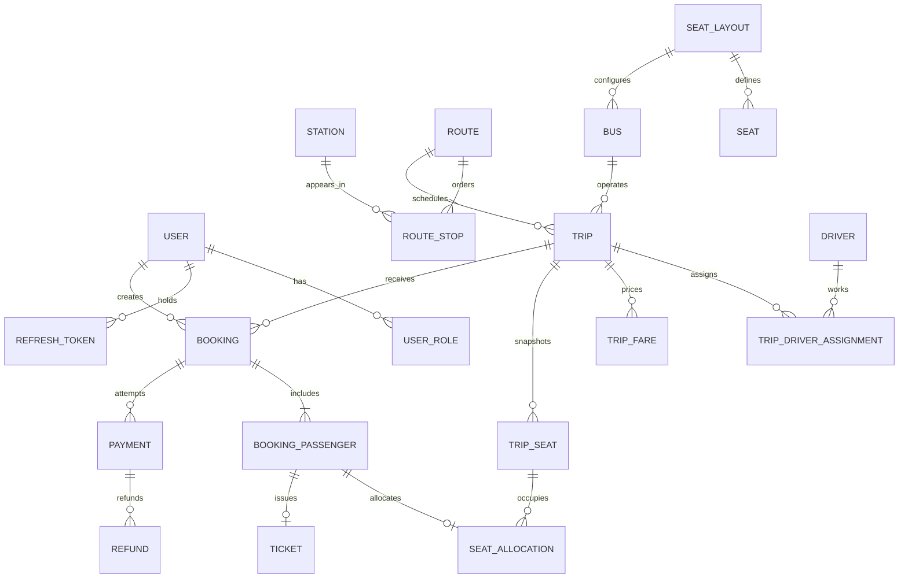

# Target database model

Increment 0 implements only `foundation_metadata` and Flyway's history table. Everything below is the target relationship design, to be migrated incrementally.

| Owner | Entities / principal relationships |
|---|---|
| Auth/User | User 1:N UserRole; User 1:N RefreshToken |
| Station/Route | Route 1:N RouteStop; Station 1:N RouteStop; Route origin/destination reference Station |
| Fleet | SeatLayout 1:N Seat; SeatLayout 1:N Bus; Driver independent of User |
| Trip | Route 1:N Trip; Bus 1:N Trip; Trip 1:N TripDriverAssignment; Driver 1:N TripDriverAssignment; Trip 1:N TripFare; Trip 1:N TripSeat |
| Booking | Booking 1:N BookingPassenger; BookingPassenger 1:0..1 SeatAllocation; TripSeat 1:N SeatAllocation; Trip 1:N Booking; User 1:N Booking as creator and optionally customer |
| Payment | Booking 1:N Payment attempts; Payment 1:N Refund |
| Ticket | BookingPassenger 1:0..1 Ticket |

RouteStop supplies ordered boarding/alighting positions. TripFare and Booking reference valid segments of the trip route. TripSeat is the immutable trip-specific seat snapshot, not a live view of a subsequently edited layout. Consult the [source specification](FINAL_SPEC.md) for every entity's exact fields before its migration.

## Invariants to introduce with each owning feature

- BIGINT identity keys; NUMERIC(12,2)/BigDecimal money; Instant/TIMESTAMPTZ timestamps. Store currency explicitly where required by the specification.
- Unique route stop order within a route; positive increasing positions; origin and destination match first and last route stops. Reject invalid chains in the service transaction.
- Unique seat labels per layout and trip; snapshot TripSeat at scheduling stage. Assignment conflicts cover both buses and drivers.
- Segment intervals are half-open `[from, to)`: overlap iff `a.from < b.to && b.from < a.to`. Adjacent journeys may reuse a seat.
- Only HELD and CONFIRMED allocations block inventory. Holds belong to pending bookings and allocations, not a second independent hold table.
- Check valid segment bounds and trip membership, FK integrity, mandatory booking creator, optional customer for walk-ins, and nonnegative decimal amounts.
- Lock stable TripSeat rows in deterministic order for every inventory mutation. Expiration/confirmation coordinate on the booking row. Add database enforcement and real PostgreSQL race tests with Increment 12.
- Payment idempotency and unique provider transaction identifiers prevent duplicate processing. Unique allocation and ticket references per passenger prevent duplicate allocation records and ticket issuance. Refund references payment without a redundant booking FK.
- Never cascade-delete financial history. Status transitions and cancellation/refund eligibility belong in policies and transactional services.

Do not create all target tables now. Each feature brings its own new Flyway migration, constraints, API and tests. Never rewrite an applied migration. Production uses a restricted runtime DB role and a separate migration role when deployment is implemented.
